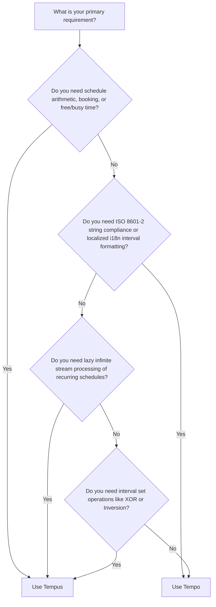

# Comparing Tempus and Tempo

Both [`Tempus`](https://github.com/am-kantox/tempus) and [`Tempo`](https://github.com/kipcole9/tempo) are Elixir libraries designed for working with time intervals, periods, and recurrences. However, they were created with fundamentally different design philosophies, mathematical foundations, and primary target use cases.

This guide provides a detailed comparison between `Tempus` and `Tempo` to help you choose the right tool for your project.

---

## Executive Summary: Which One Should You Use?

- **Use `Tempus` when** you are building **scheduling engines, calendar availability software, booking systems, or schedule arithmetics** (e.g., "calculate arrival time adding 15 business hours while skipping weekends, holidays, and busy slots", "find the next free 30-minute slot", or "compute the inverse of a busy calendar").
- **Use `Tempo` when** you need **strict ISO 8601-2 compliance, ISO 8601 duration parsing (`P1Y2M3D`), or localized date/time interval formatting** across international locales (especially when integrating with `Cldr` / `ex_cldr`).

---

## Architectural Comparison

### 1. Mathematical Foundations & Interval Models

#### `Tempus`
`Tempus` is grounded in **Group Theory** and formal set operations:
- Slots are represented as rigorous **half-open intervals** $[from, to)$ (`from_open: false`, `to_open: true` by default).
- Unbound endpoints (`nil`) represent negative or positive infinity ($-\infty, +\infty$) and are treated as open limits (`true`).
- Slot collections (`Tempus.Slots`) form an **Abelian Group** under set union `∪`, possessing identity elements (void slots) and inverse elements (`Slots.inverse/1`).
- Offers set operations: union (`merge`), intersection (`intersect`), symmetric difference (`xor`), and complement (`inverse`).

#### `Tempo`
`Tempo` is built around **ISO 8601-2:2019 standards** and Elixir `Calendar` types:
- Intervals are represented via ISO 8601 start/end timestamps or start/duration pairs (e.g., `2023-01-01T00:00:00Z/P1M`).
- Focuses on ISO repeating intervals (`R[n]/start/duration`).
- Integrates deeply with Elixir `Calendar` types and ISO period calculations.

---

### 2. Schedule Arithmetics & Busy/Free Time

#### `Tempus`
`Tempus` excels at **non-linear time arithmetic** across non-continuous schedules:
- **`Tempus.add/4`**: Adds or subtracts duration units (seconds, minutes, hours, days) to a timestamp, automatically jumping over occupied/busy slots in the schedule.
- **`Tempus.days_ahead/3`**: Calculates $N$ business days ahead, seamlessly skipping holidays, weekends, or arbitrary busy slots.
- **`Tempus.next_free/2` & `Tempus.next_busy/2`**: Navigates forward or backward through a schedule to locate available or occupied time slices.

```elixir
alias Tempus.{Slot, Slots}
import Tempus.Sigils

# Create a schedule from holidays and weekends
holidays = [~D[2023-12-25], ~D[2024-01-01]] |> Tempus.slots()
weekends = [~D[2023-12-30], ~D[2023-12-31]] |> Tempus.slots()
schedule = Slots.merge(holidays, weekends)

# Add 8 working hours starting from Dec 24th, skipping non-working slots
available_time = Tempus.add(schedule, ~U[2023-12-24 16:00:00Z], 8, :hour)
```

#### `Tempo`
`Tempo` focuses on ISO duration addition and interval shifting:
- Shifting dates and datetimes by ISO 8601 durations (`P1M2D`).
- Evaluating whether a date falls within an ISO interval or repeating sequence.

---

### 3. Eager vs. Lazy Stream Backends

#### `Tempus`
`Tempus` provides two interchangeable collection backends:
- **`Tempus.Slots.List`**: Eager, in-memory list representation.
- **`Tempus.Slots.Stream`**: **Lazy, infinite stream backend** that allows merging, slicing, and operating on infinite recurring schedules (e.g. cron expressions or recurring business hours) without loading them into memory.

```elixir
# Create an infinite stream of weekly recurring slots using Crontab specs
recurring_stream = Tempus.Slots.Stream.recurrent(
  Date.utc_today(),
  {7, "09:00:00", "Etc/UTC"}, # every 7 days at 09:00
  {1, "17:00:00", "Etc/UTC"}  # ending at 17:00
)

# Take the first 100 slots lazily
slots = Enum.take(recurring_stream, 100)
```

#### `Tempo`
`Tempo` provides Enumerable support for repeating ISO intervals, focusing on bounded ISO repeating series.

---

### 4. Sigils & Ergonomics

#### `Tempus`
Provides the `~I` sigil with explicit mathematical boundary indicators:
- `~I[2023-04-10 10:00:00Z → 2023-04-10 12:00:00Z)` — closed start, open end.
- `~I(2023-04-10 10:00:00Z → 2023-04-10 12:00:00Z]` — open start, closed end.
- `~I(2023-04-10)d` — wraps full 24-hour day into a half-open slot.
- `~I(nil → 2023-04-10)` — infinite open left bound.

#### `Tempo`
Provides ISO string parsing and ISO 8601-2 string representations.

---

## Side-by-Side Comparison Matrix

| Feature / Aspect | `Tempus` | `Tempo` |
| :--- | :--- | :--- |
| **Primary Focus** | Schedule arithmetic, availability, free/busy slots | ISO 8601-2 repeating intervals & durations |
| **Interval Openness Model** | Mathematical $[from, to)$ with explicit boundary flags | ISO 8601 start/end and start/duration |
| **Infinite Bounds (`nil`)** | Supported & treated as open bounds ($-\infty, +\infty$) | Standard ISO start/end boundaries |
| **Set Algebra** | Union, Intersection, `xor` (symmetric difference), Inversion | Interval containment & ISO alignment |
| **Non-linear Arithmetic (`add/4`)** | Skips busy/unavailable schedule slots | Standard ISO duration addition |
| **Stream Processing** | Infinite lazy streams (`Tempus.Slots.Stream`) | Enumerable ISO recurring sequences |
| **Cron Support** | Integrated `Tempus.Crontab` parser | ISO repeating interval patterns |
| **Dependencies** | Minimal & lightweight (`formulae`, `avl_tree`) | `ex_cldr` / ISO calendar ecosystem |
| **Internationalization / i18n** | Timezone shifting (`shift_tz`) | Rich `Cldr` localized formatting |

---

## Detailed Use Case Decision Tree



### Choose `Tempus` if:
1. You are building an **appointment booking system**, **resource scheduling engine**, or **calendar app**.
2. You need to calculate **working hours / business days** while skipping holidays, weekends, or lunch breaks.
3. You need to convert a list of busy slots into free slots (`Slots.inverse/1`).
4. You work with **infinite recurring streams** of availability.
5. You want a lightweight library with concise mathematical sigil syntax (`~I`).

### Choose `Tempo` if:
1. Your application must parse or output standard **ISO 8601-2 string formats** (e.g. `R3/2023-01-01T00:00:00Z/P1D`).
2. You need to parse ISO 8601 duration strings (`P1Y2M3DT4H`).
3. You require **localized string formatting** of intervals across multiple languages using `Cldr`.
4. You are already heavily integrated into the `ex_cldr` suite of libraries.
