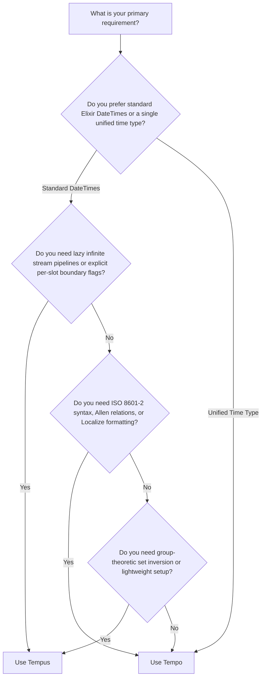

# Comparing Tempus and Tempo

Both [`Tempus`](https://github.com/am-kantox/tempus) and [`Tempo`](https://github.com/kipcole9/tempo) are Elixir libraries designed for working with time intervals, periods, and recurrences. However, they approach time modeling, standards compliance, and scheduling from distinct design philosophies.

This guide provides a detailed comparison between `Tempus` and `Tempo` to help you choose the right tool for your project.

---

## Core Value Propositions & Philosophies

- **`Tempo`** treats **time primarily as an interval, not an instant**. By centering on interval mathematics, `Tempo` provides a **single, unified time type** (replacing separate `Date`, `Time`, `DateTime`, and `NaiveDateTime` types). It strictly implements **ISO 8601-2:2019 standards** (including open intervals, duration arithmetic, and unbounded recurrences), full set algebra, Allen-relation interval logic, territory-aware business calendars, and constraint-based schedule networks (`Tempo.Network`).
- **`Tempus`** grounds slot management in **Group Theory** and discrete datetime slots (`Tempus.Slot`). It models collections of slots as an **Abelian Group** under union with identity and inverse elements. `Tempus` emphasizes **lazy infinite stream processing** (`Tempus.Slots.Stream`), explicit per-slot mathematical boundary flags (`[a, b)`, `(a, b]`, etc.), and lightweight, zero-overhead schedule arithmetic.

---

## Executive Summary: Which One Should You Use?

- **Use `Tempus` when** you need:
  - Group-theoretic set operations (e.g., computing identity and inverse slots via `Slots.inverse/1`),
  - **Lazy infinite stream pipelines** (`Tempus.Slots.Stream`) for merging, slicing, or composing infinite recurring schedules without loading them into memory,
  - Custom per-slot boundary configurations (explicitly defining closed vs. open endpoints),
  - A lightweight library with minimal dependencies working directly on standard Elixir `DateTime` types.

- **Use `Tempo` when** you need:
  - A **unified time type** instead of managing separate `Date`, `Time`, `DateTime`, and `NaiveDateTime` types,
  - **Strict ISO 8601-2 compliance** (open intervals like `~o"2026-01-01/.."`, ISO durations `P1Y2M3D`, and unbounded recurrences `R/...`),
  - **Allen-relation interval comparisons** (e.g., `before`, `meets`, `overlaps`, `finishes`),
  - Complex constraint scheduling via `Tempo.Network` or territory-aware business-day arithmetic with holiday calendars,
  - Localized date/time interval formatting via `Localize`.

---

## Detailed Architectural Comparison

### 1. Interval Models & Endpoint Openness

Both libraries adopt **strict half-open $[from, to)$** as their standard core convention, but handle boundaries and infinity differently:

#### `Tempus`
- Slots (`Tempus.Slot`) wrap standard Elixir `DateTime` values and default to half-open $[from, to)$.
- Allows explicit per-slot flags for boundary openness (`from_open`, `to_open`), supporting $[a, b)$, $(a, b]$, $[a, b]$, or $(a, b)$.
- Unbound endpoints are represented as `nil`, treated as negative or positive infinity ($-\infty, +\infty$).

#### `Tempo`
- Uses a **unified time type** for all time concepts rather than separate `Date`/`DateTime` types.
- Follows ISO 8601-2 open-interval syntax with first-class sigil support:
  - `~o"2026-01-01/.."` — open end ($+\infty$),
  - `~o"../2026-01-01"` — open start ($-\infty$).
- Supports both bounded (`R5/...`) and **unbounded recurrences** (`R/...`) per ISO 8601-2.

---

### 2. Set Algebra, Allen Relations & Schedule Arithmetic

Both libraries offer powerful set algebra and schedule manipulation, with different domain emphases:

#### `Tempus`
- Slot collections (`Tempus.Slots`) form an **Abelian Group** under set union `∪`, featuring identity elements (void slots) and inverse elements (`Slots.inverse/1`).
- Provides set operations: `merge` (union), `intersect` (intersection), `xor` (symmetric difference), and `inverse` (complement).
- Provides schedule arithmetic (`Tempus.add/4`, `Tempus.days_ahead/3`, `Tempus.next_free/2`, `Tempus.next_busy/2`) that automatically jumps over busy or non-working slots.

#### `Tempo`
- Full set algebra: union, intersection, difference, and complement (with `:bound`).
- **Allen-relation comparison**: complete set of 13 interval relations (e.g., `before`, `meets`, `overlaps`, `starts`, `during`, `finishes`, `equals`, and their converses).
- **Business-day arithmetic**: territory-aware weekends and holiday calendars.
- **Constraint scheduling**: expressible via `Tempo.Network`. Complex scenarios like "Arrival time skipping weekends, holidays, and busy slots" are directly expressible in Tempo.

---

### 3. Stream & Recurrence Backend

#### `Tempus`
- Provides two collection backends:
  - `Tempus.Slots.List`: Eager, in-memory representation.
  - **`Tempus.Slots.Stream`**: **Lazy, infinite stream backend** for merging, slicing, and evaluating infinite recurring slots (e.g., cron expressions) on demand.

#### `Tempo`
- Implements `Enumerable` for ISO 8601 repeating series (`R/...`), supporting both bounded and unbounded ISO recurrence rules.

---

### 4. Dependencies & Localization

#### `Tempus`
- Minimal, lightweight dependency footprint (`formulae`, `avl_tree`).
- Basic timezone conversion helpers (`shift_tz`).

#### `Tempo`
- Powered by `Localize` for internationalized interval formatting.
- **Time-zone-database agnostic**: recent releases eliminated heavy transitive dependencies (such as `tzdata` or `hackney`), resulting in a clean dependency chain.

---

## Side-by-Side Comparison Matrix

| Feature / Aspect | `Tempus` | `Tempo` |
| :--- | :--- | :--- |
| **Primary Value Proposition** | Group-theoretic schedule arithmetic & lazy stream processing | Unified time type, ISO 8601-2 compliance & interval set logic |
| **Time Representation** | `Tempus.Slot` wrapping standard Elixir `DateTime` | Single unified time type (replacing `Date`, `Time`, `DateTime`, etc.) |
| **Core Interval Convention** | Strict half-open `[from, to)` (with optional custom boundary flags) | Strict half-open `[from, to)` |
| **Open / Infinite Endpoints** | `nil` represents $-\infty / +\infty$ | First-class ISO 8601-2 open syntax (`~o"2026-01-01/.."`, `~o"../2026"`) |
| **Set Algebra & Interval Logic** | Union (`merge`), Intersection (`intersect`), `xor`, Complement (`inverse`) | Full set algebra (union, intersection, difference, complement with `:bound`) & Allen relations |
| **Schedule & Business Arithmetic** | `Tempus.add/4`, `days_ahead/3` jumping busy slots | Territory-aware business calendars & `Tempo.Network` constraint scheduling |
| **Recurrences & Streams** | Infinite lazy streams (`Tempus.Slots.Stream`, `Crontab`) | Enumerable ISO recurring sequences (`R/...`), bounded & unbounded |
| **Dependencies** | Minimal (`formulae`, `avl_tree`) | `Localize` (lightweight, timezone-database agnostic, no `tzdata`/`hackney`) |
| **Localization / Formatting** | Timezone shifting (`shift_tz`) | Rich localized interval formatting via `Localize` |

---

## Detailed Use Case Decision Tree

### Choose `Tempus` if:
1. You are working directly with standard Elixir `DateTime` types and `Tempus.Slot` abstractions.
2. You need **lazy infinite stream processing** (`Tempus.Slots.Stream`) to handle infinite recurring schedule pipelines without loading slots into memory.
3. You need group-theoretic set inversions (`Slots.inverse/1`) on custom slot lists.
4. You require explicit custom boundary openness per slot (e.g. $(a, b]$ vs $[a, b)$).
5. You prefer a lightweight, minimal-dependency library.

### Choose `Tempo` if:
1. You want a **single unified time type** across your codebase instead of juggling `Date`, `Time`, `DateTime`, and `NaiveDateTime`.
2. Your application requires standard **ISO 8601-2 open intervals** (`~o"2026-01-01/.."`) or ISO duration parsing (`P1Y2M3D`).
3. You need **Allen-relation comparisons** (e.g., `meets`, `overlaps`, `finishes`).
4. You use **`Tempo.Network` constraint scheduling** or territory-aware business-day arithmetic with holiday calendars.
5. You need **localized string formatting** of time intervals via `Localize`.

---

> All-in-all, Tempo’s primary value proposition is that by considering time as an interval, not an instant, we solve a number of thorny time issues - and derive some interesting properties by thinking of time primarily as a set of intervals that can be operated on by set operations. We also end up with a unified time type - one type instead of Date, Time, DateTime and NaiveDateTime.
> — [Kip Cole](https://forum.elixirforum.com/u/kip), the author of Tempo
